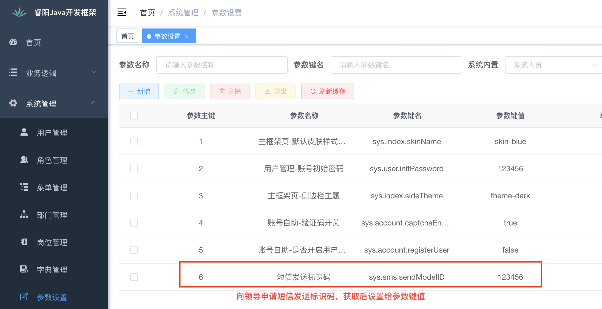

<h1 align="center" style="margin: 30px 0 30px; font-weight: bold;">Risun Java v1.0.0</h1>
<h4 align="center">基于Ruoyi v3.8.3 前后端分离的Java快速开发框架</h4>


## 一. 框架简介

本框架基于 [若依分离版](http://doc.ruoyi.vip/ruoyi-vue/) 进行二次开发，若依的所有功能均可正常使用，并涵盖了更多的基础功能和公共业务模块。

## 二. 使用说明

当有一个新项目要进行开发，需要进行如下操作。

### 1. 下载项目

下载 [开发框架](https://192.168.1.30/risun/java-web/-/archive/main/java-web-main.zip)，下载完成后，进行解压，解压后将目录名修改为您的项目名称（英文）。

### 2. 修改项目包路径

- 进入项目目录，修改 new_project.sh （或 new_project_mac.sh）

```shell
## 找到
projectName="xx-sys"
projectCN="XX管理系统"

## 根据实际项目进行修改
projectName="gangu"
projectCN="干谷社区管理系统"
```

- 执行脚本

```shell
## Linux 系统
bash new_project.sh

## MAC 系统
bash new_project_mac.sh
```

## 三. 开发说明

### 1. 将项目导入到你的IDE中

### 2. 创建文件上传目录

在你`项目名-admin`目录下，创建文件夹`files`。

***（ 注意：不要将 `files` 文件夹加入到版本控制中）*** 

### 3. 根据实际项目修改配置

```yml
## application.yml
redis:
  # 地址
  host: localhost
  # 端口，默认为6379
  port: 6379
  # 数据库索引
  database: 0
  
## application-druid.yml
spring:
  datasource:
    type: com.alibaba.druid.pool.DruidDataSource
    driverClassName: com.mysql.cj.jdbc.Driver
    druid:
      # 主库数据源
      master:
        url: jdbc:mysql://localhost:3306/risun_project?useUnicode=true&characterEncoding=utf8&zeroDateTimeBehavior=convertToNull&useSSL=true&serverTimezone=GMT%2B8
        username: 用户名
        password: 密码
```

### 4. 业务开发

项目在业务逻辑都在 `项目名-biz`模块下进行开发。如果要修改模块的名称，则需要修改以下地方。例如：修改为 `xx-build`

- `项目名-biz` 下 pom.xml

```xml
<!-- 找到 -->
<artifactId>项目名-biz</artifactId>
<!-- 修改为 -->
<artifactId>xx-build</artifactId>
```

- 项目根目录下的 pom.xml

```xml
<!-- 找到 -->
<dependency>
  <groupId>com.risun</groupId>
  <artifactId>项目名-biz</artifactId>
  <version>${project.version}</version>
</dependency>
...
<module>项目名-biz</module>

<!-- 修改为 -->
<dependency>
  <groupId>com.risun</groupId>
  <artifactId>xx-build</artifactId>
  <version>${project.version}</version>
</dependency>
...
<module>xx-build</module>
```

- `项目名-admin` 下的 pom.xml

```xml
<!-- 找到 -->
<dependency>
  <groupId>com.risun</groupId>
  <artifactId>项目名-biz</artifactId>
</dependency>

<!-- 修改为 -->
<dependency>
  <groupId>com.risun</groupId>
  <artifactId>xx-build</artifactId>
</dependency>
```

### 5. 项目启动

Windows环境下，可能会报如下错误，需要添加 JVM 启动参数 `-Djdk.io.File.enableADS=true`

```ABAP
java.lang.NoClassDefFoundError: Could not initialize class org.xnio.conduits.Conduit
```

### 6. 图片代理

若依默认的图片请求访问后台地址会根据`/profile`进行匹配，这里修改为`/project-profile`（默认，会随项目而定）。主要是为了解决同一台服务器上部署多个项目，引发路径重复的问题。

修改的位置：`project-common 下 Constants.java 中的 RESOURCE_PREFIX`

### 7. 邮件服务

框架自带邮件服务，可用于发送邮件。

- 使用邮件服务，需要进行修改配置 application.yml

```yaml
## 修改下面的配置
mail:
  ## SMTP 服务器
  host: smtp.163.com    
  ## 发送端的用户邮箱名      
  username: test@163.com
  ## 发送端的密码（授权密码，不是邮箱密码）
  password: 123456
```

- 邮件服务类 `EmailFactory`，测试类 `EmailFactoryTests`

### 8. 短信服务

框架自带短息服务，可用于发送短信。

- 修改系统参数



- 短信服务类 `SmsFactory`，测试类 `SmsFactoryTests`
