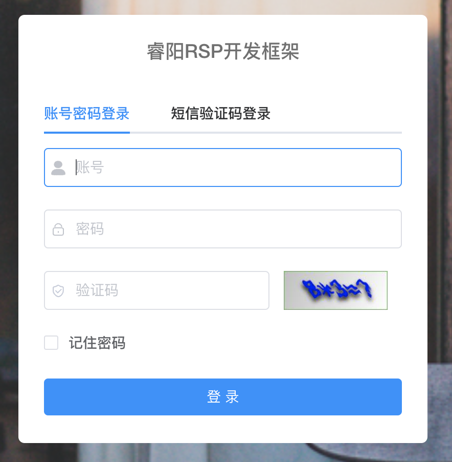
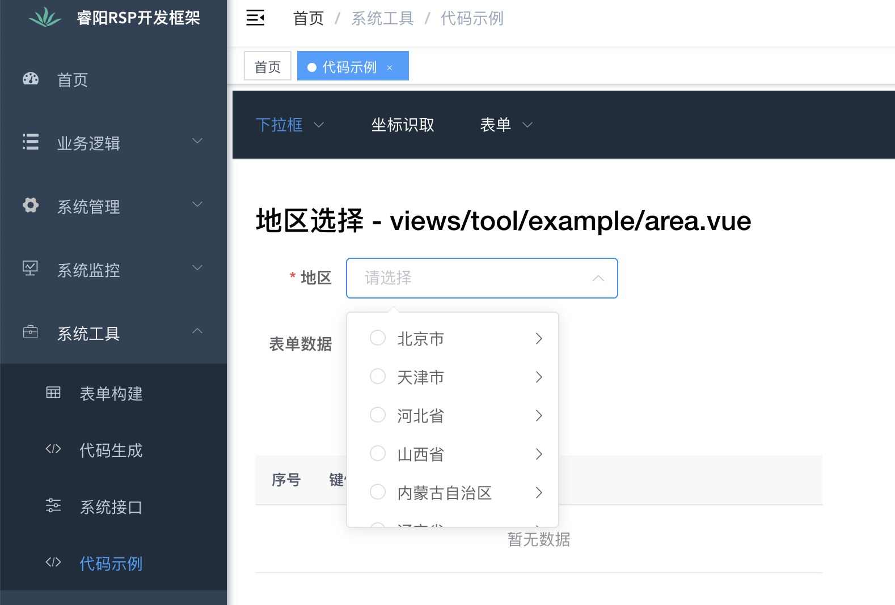

<h1 align="center" style="margin: 30px 0 30px; font-weight: bold;">Risun Java v3.0.1</h1>
<h4 align="center">基于Ruoyi v3.8.4 前后端分离的Java快速开发框架</h4>


## 一. 框架简介

本框架基于 [若依分离版](http://doc.ruoyi.vip/ruoyi-vue/) 进行二次开发，若依的所有功能均可正常使用，并涵盖了更多的基础功能和公共业务模块。

## 二. 使用说明

当有一个新项目要进行开发，需要进行如下操作。

### 1. 下载项目

下载 [开发框架](https://192.168.1.30/risun/java-web/-/archive/main/java-web-main.zip)，下载完成后，进行解压，解压后将目录名修改为您的项目名称（英文）。

### 2. 修改项目包路径

- 进入项目目录，修改 new_project.sh （或 new_project_mac.sh）

```shell
## 找到
projectName="xx-sys"
projectCN="XX管理系统"

## 根据实际项目进行修改
projectName="gangu"
projectCN="干谷社区管理系统"
```

- 执行脚本

```shell
## Linux 系统
bash new_project.sh

## MAC 系统
bash new_project_mac.sh
```

## 三. 开发说明

### 1. 将项目导入到你的IDE中

### 2. 根据实际项目修改配置

```yml
## application.yml
risun:
  profile: <文件上传目录>
  
## application-druid.yml
spring:
  datasource:
    type: com.alibaba.druid.pool.DruidDataSource
    driverClassName: com.mysql.cj.jdbc.Driver
    druid:
      # 主库数据源
      master:
        url: jdbc:mysql://<数据库url>/<数据库>?useUnicode=true&characterEncoding=utf8&zeroDateTimeBehavior=convertToNull&useSSL=true&serverTimezone=GMT%2B8
        username: <数据库账号>
        password: <数据库密码>
```

### 4. 业务开发

项目在业务逻辑都在 `项目名-biz`模块下进行开发。如果要修改模块的名称，则需要修改以下地方。例如：修改为 `xx-build`

- `项目名-biz` 下 pom.xml

```xml
<!-- 找到 -->
<artifactId>项目名-biz</artifactId>
<!-- 修改为 -->
<artifactId>xx-build</artifactId>
```

- 项目根目录下的 pom.xml

```xml
<!-- 找到 -->
<dependency>
  <groupId>com.risun</groupId>
  <artifactId>项目名-biz</artifactId>
  <version>${project.version}</version>
</dependency>
...
<module>项目名-biz</module>

<!-- 修改为 -->
<dependency>
  <groupId>com.risun</groupId>
  <artifactId>xx-build</artifactId>
  <version>${project.version}</version>
</dependency>
...
<module>xx-build</module>
```

- `项目名-admin` 下的 pom.xml

```xml
<!-- 找到 -->
<dependency>
  <groupId>com.risun</groupId>
  <artifactId>项目名-biz</artifactId>
</dependency>

<!-- 修改为 -->
<dependency>
  <groupId>com.risun</groupId>
  <artifactId>xx-build</artifactId>
</dependency>
```

### 5. 项目启动

Windows环境下，可能会报如下错误，需要添加 JVM 启动参数 `-Djdk.io.File.enableADS=true`

```ABAP
java.lang.NoClassDefFoundError: Could not initialize class org.xnio.conduits.Conduit
```

### 6. 图片代理

若依默认的图片请求访问后台地址会根据`/profile`进行匹配，这里修改为`/project-profile`（默认，会随项目而定）。主要是为了解决同一台服务器上部署多个项目，引发路径重复的问题。

修改的位置：`project-common 下 Constants.java 中的 RESOURCE_PREFIX`

### 7. 邮件服务

框架自带邮件服务，可用于发送邮件。

- 使用邮件服务，需要进行修改配置 application.yml

```yaml
## 修改下面的配置
mail:
  ## SMTP 服务器
  host: smtp.163.com    
  ## 发送端的用户邮箱名      
  username: test@163.com
  ## 发送端的密码（授权密码，不是邮箱密码）
  password: 123456
```

- 邮件服务类 `EmailFactory`，测试类 `EmailFactoryTests`

### 8. 短信服务

框架自带短息服务，可用于发送短信。

- 修改系统参数


- 短信服务类 `SmsFactory`，测试类 `SmsFactoryTests`

### 9. 登录增强

框架对登录功能进行了增强，增加短信验证码登录方式。若只需要账号登录，将 `login.vue` 中的 `smsEnabled` 设为 false 即可。



### 10. 业务附件

框架对附件上传功能进行了增强，新增附件表`sys_attachment`。使用时需要传递业务模块`bizModel`。

```vue
<!-- 业务模块名可以设置为业务模块的domain -->
<file-upload v-model="form.attachment" :bizModel="'<业务模块名>'" :disabled="disabled"/>
```

### 11. 项目健康指数和客户活跃度感知

框架添加项目健康指数和客户活跃度感知统一接口，用于检测已交付项目客户使用的活跃度。接口的实现类为 `SysMonitor4RisunController`，BaseURI 是 `/risun/monitor`，接口可匿名访问。

BaseURI：`/risun/monitor`，请求方式：POST

| 接口名                 | URI                                  | 参数                          | 状态                       |
| ---------------------- | ------------------------------------ | ----------------------------- | -------------------------- |
| 每日用户访问数         | /user_visit_count/{queryDate}        | 查询日期，格式必须为 yyyyMMdd | 框架自带                   |
| 每日新用户新增数       | /user_increase_count/{queryDate}     | 查询日期，格式必须为 yyyyMMdd | 框架自带                   |
| 每日核心业务数据新增数 | /business_increase_count/{queryDate} | 查询日期，格式必须为 yyyyMMdd | 未实现，需业务系统自行实现 |

### 12. 信息发布

框架添加了信息发布功能，包含信息草稿、审批、发布、浏览功能。菜单位于**系统管理 —> 信息管理**。

涉及角色：信息录入员、信息管理员

功能权限说明：

| 功能                                                       | 角色                             |
| ---------------------------------------------------------- | -------------------------------- |
| 新增、修改、删除                                           | 信息录入员（√）  信息管理员（√） |
| 批量通过、批量驳回、通过、驳回                             | 信息录入员（X）  信息管理员（√） |
| 设置匿名访问、取消匿名访问、设置访问范围、启用、停用、置顶 | 信息录入员（√）  信息管理员（√） |

其他说明：

- 置顶：同时只能有一条记录被置顶。

- 设置访问范围后，匿名访问会被取消。

### 13. 代码示例

框架添加了代码示例菜单（系统工具—> 代码示例），包含了日常开发中一些通用、特别的功能，便于开发人员参考。



### 14. 增强工具

- Word导出

  添加依赖Poi-tl 1.10.4

- Word转PDF

  工具类Word2PdfUtil.java，测试类Word2PdfUtilTests

- Hutool

  添加依赖 Hutool 5.8.4。官网：https://hutool.cn/docs

  开发时，不要去写太多的工具类，Hutool包含的工具类已经覆盖了99%的场景，我们只需写业务相关的工具类。

- 汉字转拼音工具类

  添加依赖 pinyin4j 2.5.0，工具类PinyinUtil.java

- 添加 lombok 插件

- Moment.js

  添加 Moment.js 2.29.4，前端日期处理类库。官网：http://momentjs.cn

  ```js
  this.$moment(new Date()).format("YYYY-MM-DD")	// 2022-10-24
  ```

- 集成jsencrypt实现密码加密传输方式

  ```js
  import { encrypt, decrypt } from '@/utils/jsencrypt'
  
  encrypt(this.loginForm.password)
  decrypt(this.loginForm.password)
  ```

- 地址地图选择组件

  （前端）框架添加地址地图选择组件，`@/components/AddressMapSelect`。具体使用方式请参考代码示例。

### 15. 代码生成

框架对代码生成进行了修改，修改内容如下

- 去除PUT、DELETE方式的HTTP方法，替换为POST。（安全考量，https://cloud.tencent.com/developer/article/1472910）
- 列表页和详情页分离，便于组件化开发。
- 添加查看按钮及相关逻辑。
- 根据数据库设计，自动的为文本框和文本域设置 `maxlength` 和 `show-word-limit`。

### 16. 视频播放组件

（前端）框架添加视频播放组件，`@/components/Video`，可用于对接视频监控功能。具体使用方式请参考代码示例。

### 17. 页面水印

（前端）框架添加了页面水印功能。具体使用方式请参考代码示例。

### 18. 审批记录

框架设计了一个统一的审批记录表，`sys_approval_log`。当业务中有审批逻辑时，在 `sys_approval_log` 中插入一条数据。相关的处理类为`ISysOperLogService.java`、`ApprovalFlowConstats.java`。

### 19. 富文本编辑器

框架更换了原来的富文本编辑器`quill`，更换为 [Tinymce](https://www.tiny.cloud/docs)。`TinyMCE`的优势：

- 开源可商用，基于LGPL2.1
- 插件丰富，自带插件基本涵盖日常所需功能
- 接口丰富，可扩展性强，有能力可以无限拓展功能
- 界面好看，符合现代审美
- 提供经典、内联、沉浸无干扰三种模式
- 对标准支持优秀（自v5开始）
- 多语言支持，官网可下载几十种语言

### 20. 密码功能增强

1. 增强密码强度策略，用户密码长度不能少于6位，包含字母、数字、特殊字符

2. 用户首次登录，初始密码必须修改配置

   可在**系统管理 —> 参数设置**页面中进行配置。

   

3. 用户周期性提示密码修改配置

   可在**系统管理 —> 参数设置**页面中进行配置。

   

### 21. 列表长字段

开发中，经常会遇到列表中要显示一些很长的字段的场景，例如：备注字段。框架中添加了处理这种情况的组件，具体使用方式请参考代码示例。

```vue
<el-table-column label="备注1">
  <template slot-scope="scope">
		<long-table-col :str="scope.row.remark1"/>
  </template>
</el-table-column>
<el-table-column label="备注2">
  <template slot-scope="scope">
		<long-table-col :str="scope.row.remark2" :len="7"/>
  </template>
</el-table-column>
<el-table-column label="备注3">
  <template slot-scope="scope">
		<long-table-col :str="scope.row.remark3" :len="8" :width="400" :maxHeight="80"/>
  </template>
</el-table-column>
<el-table-column label="备注4">
  <template slot-scope="scope">
		<long-table-col :str="scope.row.remark4" :len="8" :width="300" :maxHeight="100" placement="right-end" trigger="click"/>
  </template>
</el-table-column>
```

### 22. 部门用户选择

框架添加部门用户选择组件，适用于用户选择的场景，页面布局为左（部门）树右（用户列表）表，用户单选或多选。使用详情请查看 `代码示例 ——> 用户选择`

### 23. 消息提醒

框架添加了消息提醒功能，使用详情请[点击查看](http://116.176.33.76:9103/pages/a659e3/)

### 24. 资源打包成ZIP下载

框架添加了将资源打包成ZIP并下载的功能，使用详情请[点击查看](http://116.176.33.76:9103/pages/d875ee/)

### 25. 二维码生成工具

框架添加了二维码生成工具，`QrCodeUtils.java`，使用详情可参考代码示例。

## 四. 更新记录

### **v3.0.1**

更新时间 2022-12-16 17:50

1. Hutool 版本升级到 5.8.10
2. Fastjson2 版本升级到 2.0.20
3. 优化富文本编辑器，添加首行缩进插件、禁用URL自动转换
4. 添加部门用户选择组件，使用详情请查看 `代码示例 ——> 用户选择`
5. 消息提醒功能
6. 系统用户支持按拼音、姓名首字母拼音搜索
7. 资源打包成ZIP下载
8. 区分部署多个项目Redis缓存
9. 二维码生成工具
10. 验证码版本升级到 2.3.3
