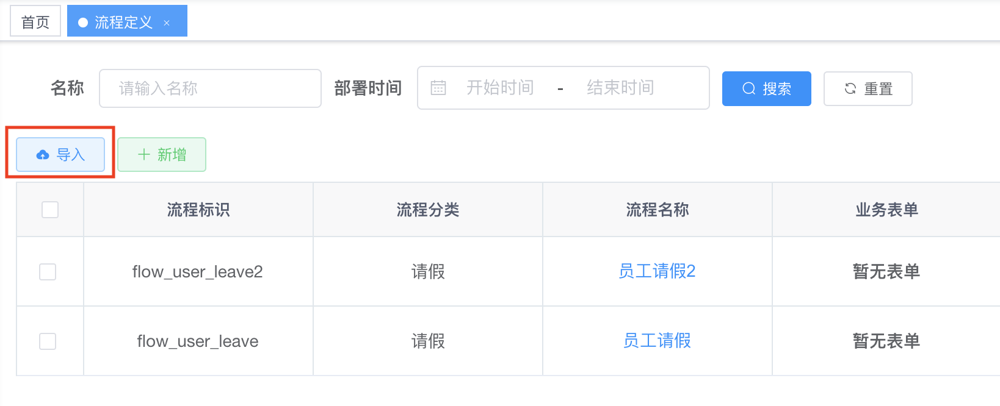
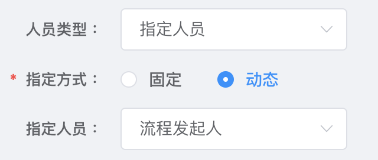
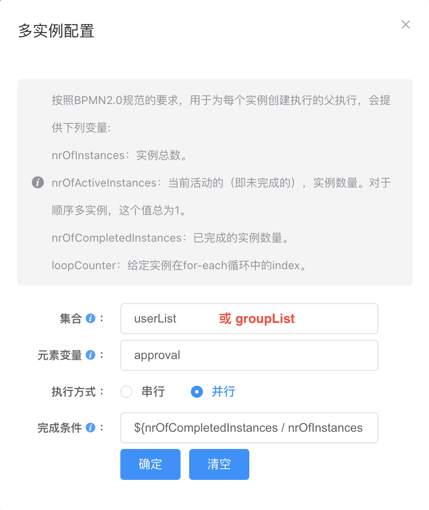
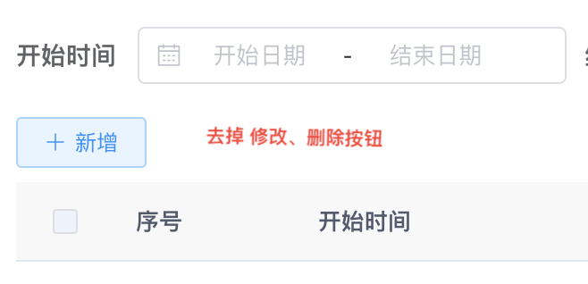

## 一. 框架简介

本框架基于睿阳RSP开发框架，集成 [Flowable](https://tkjohn.github.io/flowable-userguide/) 6.7.2，分为工程版和插件版。
- 工程版：已集成工作流相关组件，可直接使用，适用于明确要使用工作流的新项目。
- 插件版：只包含工作流涉及的组件，需要按文档集成到你现有的项目中，适用于进行过程中，需要集成工作流的项目。

## 二. 集成插件

### 1. 下载插件

下载 [工作流插件](https://192.168.1.30/risun/java-web/-/archive/flowable-plugin/java-web-flowable-plugin.zip)

### 2. 集成操作

解压下载后的 flowable.zip。（可以将project-flowable 修改为 [项目]-flowable）

- 将`project-flowable`加入工程，并修改`pom.xml`

``` xml
<parent>
    <groupId>com.risun</groupId>
    <artifactId>[项目]</artifactId>
    <version>3.0.0</version>
</parent>

<dependency>
    <groupId>com.risun</groupId>
    <artifactId>[项目]-framework</artifactId>
</dependency>
```

- 修改项目根目录下的 `pom.xml`
``` xml
<!-- 流程管理-->
<dependencyManagement>
  <dependencies>
    <dependency>
        <groupId>com.risun</groupId>
        <artifactId>project-flowable</artifactId>
        <version>${project.version}</version>
    </dependency>
  </dependencies>
</dependencyManagement>

<modules>
  <module>project-flowable</module>
</modules>
```

- 修改`<项目>-admin`目录下的 `pom.xml`
``` xml
<!-- 流程管理-->
<dependencies>
  <dependency>
      <groupId>com.risun</groupId>
      <artifactId>project-flowable</artifactId>
  </dependency>
</dependencies>
```

- 修改 `application.yml`，添加配置

  注意： 当项目库中已经生成`flowable`相关表之后，将`database-schema-update`设置为`false`
``` yml
## 工作流配置
flowable:
  database-schema-update: true
```

- 添加前端依赖
``` bash
npm i vkbeautify
npm i form-gen-parser
npm i workflow-bpmn-modeler
npm i diagram-js
```

- 将`ui`下的文件加入到`[项目]-ui`模块下（已存在的文件进行覆盖）

  - 将`styles`文件夹复制到`[项目]-ui/src/assets`下
  - 将`Process`文件夹复制到`[项目]-ui/src/components`下
  - 将`generator`文件夹复制到`[项目]-ui/src/utils`下
  - 将`flowable`文件夹复制到`[项目]-ui/src/views`下
  - 将`api/flowable`文件夹复制到`[项目]-ui/src/api`下
  - 将`build`文件夹复制到`[项目]-ui/src/views/tool`下
  - 在`<项目>-ui/src/router/index.js`中，添加如下内容
    ``` js
    // export const constantRoutes 的最后，添加
    {
      path: '/flowable',
      component: Layout,
      hidden: true,
      children: [
        {
          path: 'definition/model',
          component: () => import('@/views/flowable/definition/model'),
          name: 'Model',
          meta: { title: '流程设计', activeMenu: '/flowable/definition' }
        },
        {
          path: 'task/record/index',
          component: () => import('@/views/flowable/task/record/index'),
          name: 'Record',
          meta: { title: '流程处理' }
        }
      ]
    },
    {
      path: '/tool',
      component: Layout,
      hidden: true,
      children: [{
        path: 'build/index',
        component: () => import('@/views/tool/build/index'),
        name: 'FormBuild',
        meta: {
          title: '表单配置',
          icon: ''
        }
      }]
    }
    ```

- 执行数据库脚本 `sql/flowable.sql`

## 三. 示例说明

框架预先提供了两个流程示例，一般请假流程和会签请假流程。要使用这两个流程，需要先将 `sql/员工请假.bpmn20.xml` 和 `sql/员工请假2.bpmn20.xml` 导入到你的项目中。



框架预设了3个用户`test`、`spuser1`、`spuser2`，密码：`123@qwe`

- 一般请假流程

  - 请假 < 3天 

    员工请假申请 —> 一级审批组（spuser1）进行审批 —> 结束（驳回：回到员工请假申请）

  - 请假 >= 3天 

    员工请假申请 —> 一级审批组（spuser1）进行审批 —> 二级审批组（spuser2）进行审批 —> 结束（驳回：回到员工请假申请）

- 会签请假流程

  - 请假 < 3天 

    员工请假申请 —> 上级进行会签（spuser1、spuser2全部同意）—> 结束（驳回：回到员工请假申请）

  - 请假 >= 3天 

    员工请假申请 —> 上级进行会签（spuser1、spuser2全部同意）—> 领导（管理员）—> 审批结束（驳回：回到员工请假申请）

> 注意：要测试会签请假流程，需要对`FlowDemoServiceImpl`进行如下修改
  ``` java
  public int commitFlowDemo(FlowDemo flowDemo) {
      ...
      // flowInstanceService.commit(ProcessDefKeyConstants.KEY_FLOW_DEMO, startFlowVo);

    	// 验证多实例（3、4为spuser1、spuser2）时，请打开注释，并将上一行 flowInstanceService.commit(...) 注释
    	startFlowVo.addParams(ProcessConstants.PROCESS_MULTI_INSTANCE_USER, Lists.newArrayList("3", "4"));
    	flowInstanceService.commit(ProcessDefKeyConstants.KEY_FLOW_DEMO + "2", startFlowVo);
      ...
  }
  ```

## 四. 设计说明

本框架使用的工作流引擎是[Flowable](https://tkjohn.github.io/flowable-userguide/)，如果要对框架有更深的掌握，需要熟悉[Flowable](https://tkjohn.github.io/flowable-userguide/)。


### 1. 流程图

使用工作流框架，主要的工作就是绘制流程图，所以熟悉流程图中的相关概念是使用本框架的前提条件。下面列出必须熟知的技术点：

- 用户任务（UserTask）
- 排他网关（Exclusive Gateway）
- 条件顺序流（Conditional Sequence Flow）
- 多实例任务（Multi-instance）

本框架预设了流程处理逻辑，在绘制流程图时需要注意以下部分：

- 第一个任务处理人要设置为`流程发起人`



- 动态人员（组）的变量固定为 `approval`

- 多实例配置中，集合必须是 `userList`（候选用户）或（`groupList`（候选组）），元素变量必须是 `approval`



- 审批通过（驳回）的参数固定为 `agree`（true 同意 false 驳回）

### 2. 业务设计

涉及流程的业务，在设计时需要设计一个 uid 字段，类型为 uuid，在流程启动时，需要传递给到流程启动参数`StartFlowVo.java`中的`bizUid`字段。

``` java
/** 业务主键ID */
private String bizId;
/** 业务标识ID（不是主键，推荐UUID） */
private String bizUid;
/** 业务模块 BizModelConstants 中定义 */
private String bizModel;
/** 业务详情描述 */
private String bizDetail;
  ```
详细操作，请参考 `FlowDemoServiceImpl.java`

### 3. 业务页面

涉及流程的业务页面需要做出如下修改。

- 列表页面
  - 只保留新增操作，去掉列表上的修改、删除操作

  

  - 列表状态、行操作，需要连表`sys_flow_biz_monitor`查询

    `FlowDemoMapper.xml`
    ``` sql
    select 
      t.demo_id, t.leave_user_id, t.uid, t.start_time, t.end_time, t.leave_reason, t.create_by, t.create_time, t.update_by, t.update_time,
      t1.monitor_id, t1.proc_inst_id, t1.status, t1.passed, t1.finished, t1.commited
    from t_flow_demo t
    left join sys_flow_biz_monitor t1 on t1.biz_uid = t.uid
    ```
  - 列表状态
    ``` vue
    <el-table-column label="状态" align="center" prop="flowMonitor.status">
      <template slot-scope="scope">
        <span v-if="scope.row.flowMonitor == null" v-html="'申请'"></span>
        <span v-else>{{ scope.row.flowMonitor.status }}{{  scope.row.flowMonitor.finished ? scope.row.flowMonitor.passed ? ' - 通过' : ' - 驳回' : '' }}</span>
      </template>
    </el-table-column>
    ```
  - 行操作（修改、删除）
    ``` vue
    <el-button
      size="mini"
      type="text"
      icon="el-icon-edit"
      @click="handleUpdate(scope.row, false)"
      v-if="scope.row.flowMonitor == null || scope.row.flowMonitor.commited == true"
    >修改</el-button>
    <el-button
      size="mini"
      type="text"
      icon="el-icon-delete"
      @click="handleDelete(scope.row)"
      v-if="scope.row.flowMonitor == null || scope.row.flowMonitor.commited == true"
    >删除</el-button>
    ```

- 详情页面

  查看状态下，需要去除底部操作按钮 `v-if="!disabled"`
  ``` vue
  <div slot="footer" class="dialog-footer" style="text-align: right;" v-if="!disabled">
    <el-button type="primary" @click="submitForm(false)" v-show="!disabled">保 存</el-button>
    <el-button type="success" @click="submitForm(true)" v-show="!disabled">提 交</el-button>
    <el-button @click="cancel">取 消</el-button>
  </div>
  ```

### 4. 流程启动

框架使用流程定义Key来启动流程，框架定义了常量类`ProcessDefKeyConstants.java`来定义流程定义Key，涉及流程的业务，流程定义Key需要在该类中定义。

详细操作，请参考 `IFlowInstanceService.java` 的 `startProcessInstanceByKey(String procDefKey, StartFlowVo startFlowVo)` 方法。

### 5. 流程处理

框架中流程处理的相关操作都定义在 `IFlowTaskService.java` 中，主要方法如下：

|  方法        |   |
|  ----       | ----  |
| 审批         | approval(FlowTaskVo flowTask) |
| 转办         | assignTask(FlowTaskVo flowTaskVo) |
| 代办任务列表  | todoList(FlowQueryVo queryVo)  |
| 已办任务列表  | doneList(FlowQueryVo queryVo)  |
| 办结任务列表  | finishedList(FlowQueryVo queryVo)  |

### 6. 审批附件

有些业务在审批时，需要审批人上传附件，本框架也对这种情况做了处理。可以通过业务模块字段来进行处理：

`FlowTaskDto.java`

``` java
/** 审批过程是否需要附件 */
private Boolean hasApprovalAttach = Boolean.FALSE;

/**
  * 设置审批过程是否需要附件
  * 
  * @return
  */
public Boolean getHasApprovalAttach() {
  // 可以通过业务模块bizModel来设置是否在审核时需要传递附件
  switch (bizModel) {
    case "<业务模块>":
      // 设置 hasApprovalAttach
      break;
    default:
      break;

  }
  return this.hasApprovalAttach;
}
```
